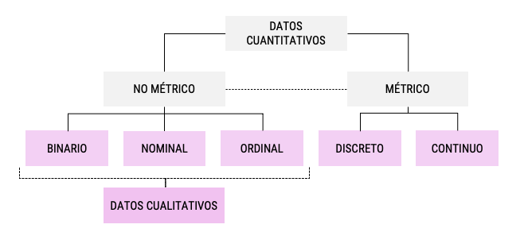

```{r include=FALSE}
options(knitr.kable.NA = '')
```

# Taller 03:

***

En la clase anterior, vimos los diferentes tipos de datos con los que nos podríamos encontrar. Estos pueden dividirse en *datos cualitativos* y *datos cuantitativos* dependiendo en el objeto que estén midiendo. Los *datos cuantitativos* pueden er clasificados como métricos y no métricos, basado en las características que definen las distancia entre los valores de la escala. 

Los datos no-métrico también los podemos encontrar como "datos cualitativos" ya que representan valores no numéricos. La más simple es una escala **binaria** donde sólo encontramos dos categorías. Las escalas **nominales** u **ordinales** pueden tener varias categorías dependiendo de la variable de interés.

Los datos métricos pueden ser clasificados en datos discretos y continuos. Cuando nos referimos a datos discretos, hablamos de datos que pueden ser cuantificados y expresado en valores enteros. Cuando los datos pueden ser cuantificados con los valores reales, se dice que es una variable continua.


Considerando el tipo de variable que tenemos en nuestro análisis, es el tipo de test de hipótesis que debemos realizar. Para la siguiente sección, utilizaremos el concepto "categórico" para hablar de las variables no-métricas o "cualitativas" y usaremos el concepto "continuo" para las variables métricas.

## Gráficos univariados y bivariados:

El **Proyecto de Opinión Pública de América Latina** más conocido como **LAPOP** es un centro de estudios de opinión y comportamiento. Este centro se destaca por sus altos estándares de calidad en cada uno de los procesos de encuestaje: desde el diseño del cuestionario y la definición de la muestra, el trabajo en terreno a través del pretesteo del cuestionario y el trabajo de campo, y su posterior supervisión; hasta el procesamiento y análisis de los datos. 

En sus inicios, Mitchell A. Seligson (fundador y Senior Advisor de LAPOP) inició LAPOP para medir e investigar los valores democráticos en Costa Rica, y con el tiempo se fue ampliando al resto de América Latina. en este caso particular, nosotros revisaremos la encuesta **Barómetro de las Américas** que estudia los valores democráticos de países en Norteamérica, Suramérica y Centroamérica. 

Pueden encontrar las bases de datos en la página principal de [LAPOP](http://datasets.americasbarometer.org/database/index.php?freeUser=true). 

Utilizaremos esta base de datos para hacer el siguiente ejercicio:

Primero, cargaremos los paquetes que utilizaremos en esta sesión:

```{r paquetes, warning=FALSE, message=FALSE}
library(tidyverse)
library(sjmisc)
library(haven)
library(kableExtra)
```


Y cargaremos la base de datos con variables ya seleccionadas:


```{r}
df_lapop_chile <- readRDS("output/lapop_chile_220824.rds")
df_lapop_chile <- read_dta("output/lapop_chile_220824.dta")
```

Entonces, nuestra base de datos contiene las siguientes variables:

```{r echo = F}
readxl::read_excel("input/220809 - Tablas.xlsx") %>% 
  knitr::kable(., align = 'lccccccccc') %>% 
  kable_styling(bootstrap_options = c("striped"), html_font = 'Roboto Condensed') %>% 
  column_spec(1, width_min = "6cm", bold = T) %>% 
  column_spec(2, width_min = "3cm", border_left = T) %>% 
  column_spec(3:10, width_min = "2cm", border_left = T) %>% 
  scroll_box(width = "100%", height = "400px")
```

Las variables `q1` y `q2` contienen las respuestas a las categorías de sexo y edad del entrevistado. En este tipo de base de datos --encuestas a personas-- es difícil tener números continuos que nos ayuden al análisis. En este caso, utilizaremos la edad como una variable continua, y la variable `EFF1` como variable categórica.

### Datos continuos:

Los *histogramas* son los gráficos que se usan normalmente para graficar variables continuas porque muestran la distribución de los valores. Esto nos permite ver la distribución de las edades de las personas encuestadas en el Barómetro de las Américas desde el 2004 al 2008.

```{r message=F}
histograma <- df_lapop_chile %>% 
  ggplot(aes(x = q2)) +
  geom_histogram()

histograma
```

Probablemente, nos gustaría ver la distribución de las edades de acuerdo a la ola de la encuesta. Para eso usamos `facet_grid` con la variable que nos interesa para segmentar el gráfico, que en este caso es `year`. En este caso, podríamos haber elegido el sexo y ver cómo se distribuyen las edades según el sexo de las personas.

```{r message=F}
df_lapop_chile %>% 
  ggplot(aes(x = q2)) +
  geom_histogram() +
  facet_grid(~year) +
  theme_minimal()
```

Quizás es necesario cambiar las etiquetas en el eje x, para ver con mayor exactitud como se distribuyen las edades. Pra eso usaremos `scale_x_continuous` y el argumento `breaks`.

```{r message=FALSE}
df_lapop_chile %>% 
  ggplot(aes(x = q2)) +
  geom_histogram() +
  scale_x_continuous(breaks = seq(0,100, by = 10)) +
  facet_grid(~year) +
  theme_minimal()
```

Finalmente, podemos cambiar los títulos y el tema de nuestros histograma:

```{r message=FALSE}
df_lapop_chile %>% 
  ggplot(aes(x = q2)) +
  geom_histogram(color = "#ffafcc", fill = "#ffc8dd", alpha = 0.5) + # Colores
  geom_density(aes(y = ..count..), color = "#ff006e") + # Gráfico de densidad
  scale_x_continuous(breaks = seq(0,100, by = 10)) +
  labs(title = "Figura 2. Histograma de las edades de los encuestados en el\nBarómetro de las Américas, ola 2006 y 2008.", x = "Edad", y = "Frecuencia") + # Títulos
  facet_grid(cols = vars(year)) +
  theme_minimal(base_family = "Roboto Condensed")

```

También podemos agregar una curva de densidad sobre el histograma, incluso la media, la mediana y los cuartiles de cada grupo.

### Datos categóricos:

Revisamos la frecuencia de acuerdo al año:

```{r}
frq(df_lapop_chile, year)
```

Para esta prgunta utilizaremos un *gráfico de barras*. Un gráfico de barras es una forma de resumir un conjunto de datos por categorías. Cada barra representa una categoría y la altura de la barra es proporcional a un tipo de agregación específica: usualmente es la frecuencia. Esta pregunta no fue formulada en la encuesta para el año 2006. Así que veremos la frecuencia para el año 2008:

```{r}
df_lapop_chile %>% 
  filter(year == 2008) %>% 
  frq(., eff1)
```

Realizamos el gráfico:

```{r message=FALSE}
df_lapop_chile %>% 
  filter(year == 2008) %>% 
  ggplot(aes(x = as_factor(eff1))) +
  geom_bar(color = "#ffafcc", fill = "#ffc8dd", alpha = 0.5) + # Colores
  scale_x_discrete(labels = function(x) str_wrap(x, width = 10)) +
  labs(title = "Figura 3. Gráfico de barras 'Interés del gobierno' (EFF1) para el año 2008.",
       subtitle = "Pregunta: 'A los que gobiernan el país le interesa lo que piensa la gente como usted\n¿Hasta qué punto está de acuerdo o en desacuerdo con esta frase?'", 
       x = " ", y = "Frecuencia") + # Títulos
  theme_minimal(base_family = "Roboto Condensed")
```

¿Para qué sirve cada uno de los argumentos?

### Cruce continuo-categórico:

Para este cruce, haremos un *boxplot*: veremos la dispersión de la edad para la pregunta eff1. El boxplot o gráfico de caja es un método estandarizado para graficar una serie de datos numéricos a través de sus cuartiles. De esta manera, se muestran a simple vista la mediana y los cuartiles de los datos, y también puede representar sus valores atípicos.

```{r}
df_lapop_chile %>% 
  filter(year == 2008) %>% 
  ggplot(aes(x = as_factor(eff1), y = q2)) +
  geom_jitter(shape = 16, position = position_jitter(0.2), color = "#588157") +
  geom_boxplot(fill = "#a3b18a", color = "#3a5a40", alpha = 0.5) +
  stat_summary(fun = mean, colour="black", geom="text", show_guide = FALSE,
               vjust=-0.7, family = "Roboto Condensed",
               aes(label = round(..y.., digits = 1))) +
  scale_x_discrete(labels = function(x) str_wrap(x, width = 10)) +
    labs(title = "Figura 4. Boxplot 'Interés del gobierno' (EFF1) por edad de los encuestados (q2) para el año 2008.",
       subtitle = "Pregunta: 'A los que gobiernan el país le interesa lo que piensa la gente como usted\n¿Hasta qué punto está de acuerdo o en desacuerdo con esta frase?'", 
       x = " ", y = "Edad") +
  theme_minimal(base_family = "Roboto Condensed")

frq(df_lapop_chile, eff1)
```

## Hacer tablas en R Markdown

Hay diferentes formas de hacerlo. Se pueden generar directamente desde la base de datos o con un archivo externo. Para hacer las tablas que ven en este documento, lo hice de manera externa porque ya tenía las hojas de cálculo pre-llenadas con la información.

Aún así, veamos algunos conceptos básicos:

En R Markdown, sólo necesitan cargar el paquete `kableExtra` para acceder a más funciones y opciones al momento de generarlas.

```{r echo = T, results = 'hide'}
library(kableExtra)
```

Primero, generaremos una tabla con la información de LAPOP. Para eso, utilizaremos la variable PN4 de nuestra base de datos `lapop_int_220824.rds`

```{r}
df_lapop_int <- readRDS("output/lapop_int_220824.rds")
```

Como vimos, siempre es bueno dar una mirada a las bases de datos antes de utilizarla. Para eso, utilizaremos `skimr::skim()`:

```{r}
skimr::skim(df_lapop_int)
```

Como podemos observar, hay una inmensa cantidad de NA. Esto sucede por varios motivos: 

Ahora, veremos en mayor detalle nuestra variable de interés, PN4:

```{r}
frq(df_lapop_int, pn4)
```

La pregunta "*En general, usted diría que está muy satisfecho, satisfecho, insatisfecho o muy insatisfecho con la forma en que la democracia funciona*" empezó a aparecer en la encuesta en el año 2008, eso podría ser una de las explicaciones para el gran número de NAs, pero también está el componente de no-respuesta. Ahora, veamos los resultados por país. En DESUC desarrollamos un paquete que nos permite hacer tablas de manera mucho más rápida y ordenada. Para eso, debemos usar `tabla_vars_segmentos()`.

```{r}
library(desuctools)

tabla_pais_pn4 <- tabla_vars_segmentos(df_lapop_int,
                                       .vars = vars(pn4),
                                       .segmentos = vars(pais),
                                       total = T)
```

Utilizamos esta función para hacer un `summarise` de los datos sin perder, por ejemplo, las etiquetas de cada variable. Esta base de datos la podemos utilizar para hacer tablas como también para hacer gráficos, de hecho, facilita mucho el trabajo con `ggplot2`.

```{r}
tabla_pais_pn4 %>% 
  knitr::kable(.) %>% # Hay algunas funciones que no nos permiten dejar el argumento 'data' vacío, para eso usamos el '.'
  kable_styling(bootstrap_options = c("striped"), html_font = 'Roboto Condensed') %>% 
  scroll_box(width = "100%", height = "300px")
```

Con `scroll_box` podemos limitar el espacio que la tabla toma en nuestra página principal.

Esta tabla tiene potencial, pero debemos mejorarla. Para eso podemos usar `select` y dejar sólo las columnas de interés:

```{r}
tabla_pais_pn4 %>% 
  select(2,5:7) %>%
  knitr::kable(.) %>% 
  kable_styling(bootstrap_options = c("striped"), html_font = 'Roboto Condensed') %>% 
  scroll_box(width = "100%", height = "300px")
```

Ya eliminamos las columnas que no eran necesarias. Ahora haremos tres cambios:

1. Uniremos las celdas repetidas en la columna *pais*, 
2. Cambiaremos el título de las columnas y
3. Cambiaremos el formato en que se presenta el porcentaje.

### 1. Colapsar las celdas repetidas de la primera columna con `collapse_rows`.

```{r}
tabla_pais_pn4 %>% 
  select(2,5:7) %>% 
  knitr::kable(.) %>% 
  collapse_rows(columns = 1, valign = 'top') %>% 
  kable_styling(bootstrap_options = c("striped"), html_font = 'Roboto Condensed') %>% 
  scroll_box(width = "100%", height = "300px")
```

### 2. Cambiaremos el título de las columnas y agregaremos el título de la tabla con los argumentos `col.names` y `caption` en `knitr::kable`.

```{r}
tabla_pais_pn4 %>% 
  select(2,5:7) %>% 
  knitr::kable(., 
               col.names = c('País','Categoría','Casos','%'),
               caption = 'Tabla 1: Respuestas acumulativas LAPOP 2008-2018.<br>
               Pregunta: En general, usted diría que está muy satisfecho, satisfecho, insatisfecho o <br>
               muy insatisfecho con la forma en que la democracia funciona en [pais].',
               align = 'llrr') %>% 
  kable_styling(bootstrap_options = c("striped"), html_font = 'Roboto Condensed') %>%
  column_spec(1:2, width_min = "3cm") %>% 
  column_spec(3:4, width_min = "2cm") %>% 
  row_spec(0, align = 'c') %>% 
  collapse_rows(columns = 1, valign = "top") %>% 
  scroll_box(width = "100%", height = "300px")

```

### 3. Por último, cambiaremos el formato del porcentaje que aparece en la última columna con `mutate`. Hay diferentes formas de hacerlo, en este caso utilizaremos el paquete `scales` que tiene la función `percent` que cambia de manera automática la variable según el formato que le pidamos. Es útil también para formatear a porcentaje u otro tipo de formato que necesitamos normalmente para graficar, cómo pesos.

```{r eval = F}
tabla_pais_pn4 %>% 
  select(2,5:7) %>% 
  mutate(prop = scales::percent(prop, accuracy = 2)) %>% 
  knitr::kable(., 
               col.names = c('País','Categoría','Casos','%'),
               caption = 'Tabla 1: Respuestas acumulativas LAPOP 2008-2018.<br>
               Pregunta: En general, usted diría que está muy satisfecho, satisfecho, insatisfecho o <br>
               muy insatisfecho con la forma en que la democracia funciona en [pais].',
               align = 'llrr') %>% 
  kable_styling(bootstrap_options = c("striped"), html_font = 'Roboto Condensed') %>%
  column_spec(1, width_min = "3cm") %>% 
  column_spec(2, width_min = "3cm") %>% 
  column_spec(3:4, width_min = "2cm") %>% 
  row_spec(0, align = 'c') %>% 
  collapse_rows(columns = 1, valign = "top") %>% 
  scroll_box(width = "100%", height = "300px")

```

Si bien las tablas siempre son útiles para leer la información al momento de hacer un análisis exploratorio, es diferente cuando queremos mostrar nuestros datos. **Esta información la podemos observar también a través de gráficos.**

# Actividades del curso:

Para la primera parte del curso, este será el avance que deberán ir logrando en sus páginas personales. La idea es que se vayan acostumbrando a usar R Markdown. Aprender R Markdown no solo los ayudará a generar este tipo de páginas, sino también a hacer todo tipo de informe y documentos académicos con todas las facilidades que entrega esto. Si no saben hacer algo, lo mejor que pueden hacer es revisar la documentación. Por ejemplo, [yo tengo que meterme siempre a leer cómo configurar cada chunk porque soy incapaz de aprendérmelo de memoria](https://rmarkdown.rstudio.com/lesson-3.html).

```{r echo = F}
readxl::read_excel("input/220809 - Tablas.xlsx", sheet = 'Sheet2') %>% 
  knitr::kable(., align = 'clcl') %>% 
  kable_styling(bootstrap_options = c("striped"), html_font = 'Roboto Condensed') %>% 
  column_spec(1, width_min = "2cm") %>% 
  column_spec(2, width_min = "4cm", border_left = T) %>% 
  column_spec(3, width_min = "3cm", border_left = T) %>% 
  column_spec(4, width_min = "3cm", border_left = T) %>% 
  row_spec(0, align = 'c') %>% 
  pack_rows("Primera parte", 1, 4)
```

***

Preparación de la base de datos de LAPOP:

```{r preparacion datos, eval = F}
df <- haven::read_dta("data/2004-2018 LAPOP AmericasBarometer Merge (v1.0FREE).dta")

colnames(df)

p_seleccion <- readxl::read_excel("input/220809 - Preguntas LAPOP.xlsx") %>% 
  mutate(year_2010 = str_to_lower(year_2010)) %>% 
  filter(!is.na(year_2010))

v_seleccion <- p_seleccion$year_2010  

frq(df, pais)

df_lapop_chile <- df %>% 
  select(pais, wave, year, v_seleccion, q2) %>% 
  filter(pais == 13) %>% 
  write_rds("output/lapop_chile_220824.rds") %>% 
  write_dta("output/lapop_chile_220824.dta")

df_lapop_int <- df %>% 
  select(pais, wave, year, v_seleccion, q2) %>% 
  write_dta(., "output/lapop_int_220824.dta") %>% 
  write_rds(., "output/lapop_int_220824.rds")

```

