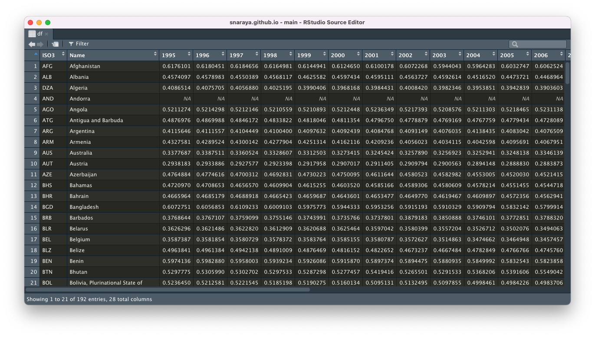
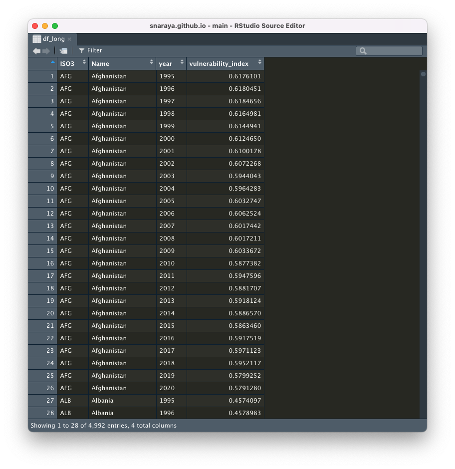

Utilizaremos el siguiente paquete que contiene las funciones necesarias para realizar el ejemplo:

```{r warning=FALSE, message=F}
library(tidyverse)
```

Ahora, cargaremos la base de datos:

```{r message=F}
df_wide <- read_csv("data/vulnerability.csv")
```

Revisamos la base de datos con la función `skim` del paquete `skimr`:

```{r}
skimr::skim(df_wide)
```

En este caso, tenemos los promedios por año del conjunto de países de nuestra base de datos, su desviación estándar, los cuartiles y un pequeño histograma que nos muestra la distribución de los datos. 

Esta base de datos contiene la información del **Índice de Vulnerabilidad**. Este se mide de 0 a 1, donde el 0 significa la ausencia de vulnerabilidad y el 1 una alta presencia de vulnerabilidad en cada uno de los países. Entonces, para 1995, tenemos que el promedio del Índice de Vulnerabilidad era de 0.46 el cual ha ido disminuyendo paulatinamente con el tiempo.

Hay dos tipos de bases de datos: las bases con formato ancho o *wide*, y las bases en formato largo o *long*. Lo común es trabajar con el segundo estilo de base de datos, pero no siempre vienen de esa manera. Por lo tanto, tenemos que cambiarlo: ¿cómo se hace esto?

R nos entrega diferentes herramientas para hacerlo. Hoy veremos la función `pivot_longer` del `tidyverse` que nos ayudará con este trabajo.

Para hacernos una idea visual, tenemos a continuación una base en formato ancho, donde tenemos una observación por país y los años son los títulos de las columnas que contienen la información que necesitamos, en este caso, de vulnerabilidad. 


¿Cómo nos gustaría que se ordenara la base de datos? Que tenga una columna con la información de los países, otra columna con los años en los que se ha medido este índice, y finalmente una columna que contenga la información del índice.

Iremos por parte:

- `pivot_longer` nos pide información sobre nuestra base de datos. En `cols` debemos identificar las columnas que pasaremos de ancho a largo. Como pueden ver, yo seleccioné las columnas identificándolas con `-` ya que son las columnas que **no quiero que cambien**.

```{r}
df_long <- df_wide %>% 
  pivot_longer(cols = -c("ISO3", "Name"), names_to = "year", values_to = "vulnerability_index")
```

En el caso de que tengas identificadas las columnas y estén en orden, se puede simplemente identificar por el lugar que tienen en la base de datos. En este caso, las primeras dos columnas son columnas que identifican al país y que no queremos que cambien, y seleccionamos la columna 3 a las 28 que contienen los años de las mediciones. A pesar que decirmos que *no cambian*, las primeras dos columnas aumentarán su número de apariciones dependiendo de la temporalidad que estemos manejando.

```{r}
df_long <- df_wide %>% 
  pivot_longer(cols = 3:28, names_to = "year", values_to = "vulnerability_index")
```

El resultado debería verse como en el ejemplo a continuación:


Teniendo esto en consideración, sigamos.

---

Ahora que tenemos la base de datos de esta manera, podemos obtener más información que la tuvimos en un principio. Para eso, usaremos el paquete `countrycode` que contiene la información de diferentes tipos de agrupaciones de los países que tenemos en la base de datos. Considerando que tenemos la información del ISO3, nos será aun más simple.

```{r}
library(countrycode)
```

En el caso de no tenerlo instalado, lo puedes hacer de la siguiente manera:

```{r eval = F}
remotes:: install_github('vincentarelbundock/countrycode') 
#Recuerda tener instalado la librería "remotes" para que esto funcione
```

Pueden obtener más información sobre este paquete [aquí](https://github.com/vincentarelbundock/countrycode).

---

¿Qué haremos ahora?

Uniremos nuestra base de datos con los datos entregados por el paquete. Seleccionaremos algunas columnas de interés:

- `continent`: Continent as defined in the World Bank Development Indicators.
- `iso3c`: ISO-3 character (que es la columna que ya tenemos en la base de datos anterior y que nos servirá para unir ambas bases de datos).
- `iso3n`: ISO-3 numeric.
- `region`: 7 Regions as defined in the World Bank Development Indicators.
- `region23`: 23 Regions as used to be in the World Bank Development Indicators (legacy).
- `imf`: International Monetary Fund.
- `wb`: World Bank (very similar but not identical to iso3c).
- `vdem`: Varieties of Democracy (V-Dem version 8, April 2018).

```{r}
df_informacion <- countrycode::codelist %>% select(continent, iso3c, iso3n, region, region23, imf, wb, vdem)
```

En el caso de buscar algo específico, puedes escribir `?codelist` en la consola y saldrán las opciones disponibles en la ventana de Help.

Ya teniendo la selección, haremos la unión de ambas bases de datos utilizando `left_join`:

Ambas opciones a continuación son válidas. Primero, ingresamos los nombres de nuestras bases de datos, y después, en `by` debemos poner las variables que unirán ambas bases de datos. En este caso, `df_long` tiene la variable `ISO3` y `df_información` tiene la variable `iso3c` que representan los mismo.

```{r eval = F}
df_general <- left_join(df_long, df_informacion, by = c("ISO3" = "iso3c"))
```

```{r}
df_general <- df_long %>% 
  left_join(df_informacion, by = c("ISO3" = "iso3c"))
```

Con esto, tenemos más información para analizar nuestros datos. Por ejemplo:

```{r}
df_general %>% 
  group_by(continent) %>% 
  summarise_at(vars(vulnerability_index), list(m=~mean(., na.rm = T), n=~n(), sd = ~sd(., na.rm = T)))
```

Por otro lado, esto nos facilita también la construcción de gráficos:

```{r echo=F}
theme_set(theme_bw(base_family = "Roboto Condensed")) 
```

```{r}
df_general %>% 
  filter(year == 2000) %>% 
  ggplot(aes(x = continent, y = vulnerability_index)) +
  geom_boxplot() +
  scale_y_continuous(breaks = seq(0, 1, 0.2), limits = c(0,1)) +
  labs(x = "Continente", y = "Índice de Vulnerabilidad", 
       title = "Índice de Vulnerabilidad por continente",
       subtitle = "Año 2000")
```


