## distill::new_post("title")

Para este curso, resulta necesario saber los pasos para subir un post al blog que creamos hace algunas semanas. El proceso puede ser fácil si sabes cómo hacerlo, en el caso de no saberlo puede ser engorroso: son muchos pasos, y hay que **hacerlos en orden**.

### Primero: crear un nuevo post

Para crear un nuevo post, debemos entrar al proyecto que guarda nuestro blog. En él, encontramos los diferentes archivos que lo componen, como el archivo `_site.yml`, index.Rmd y las carpetas de `_posts` y `docs`. Este es nuestor punto de partida:

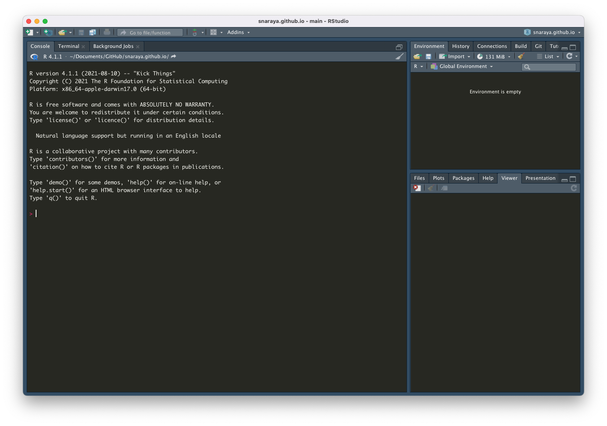

Debemos insertar el siguiente código en la Consola: `ditill::new_post()` con un título descriptivo del contenido. Recuerden que el título debe ir entre un par de comillas como el ejemplo que verán a continuación:

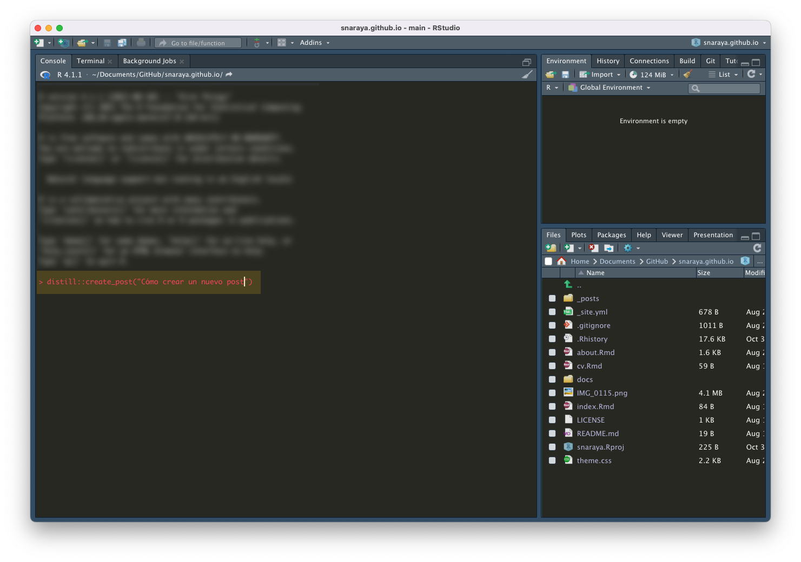
Al realizar este paso, automáticamente se creará una nueva publicación. Además, automáticamente los dejará ubicados en la carpeta que contendrá la información de la publicación. En ella sólo encontrarán un archivo `.Rmd` (R Markdown) en blanco:

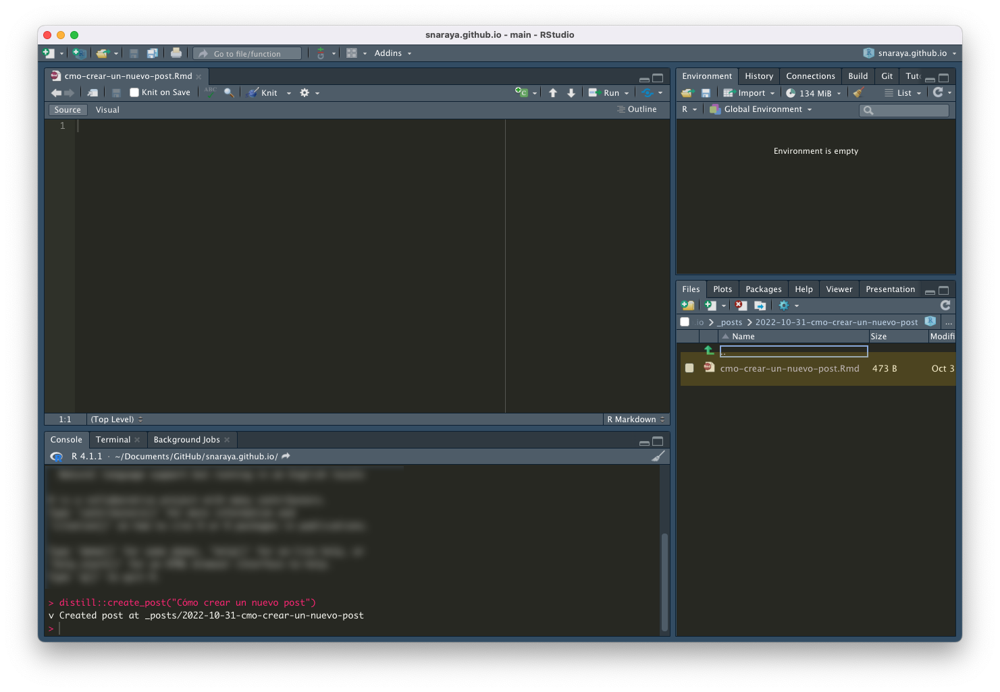
Con esto, podemos empezar a generar nuestro nuevo post.

### Contenido

Si bien el contenido lo definen ustedes, sí es importante agregar cierta información para que la publicación corra bien como página. 

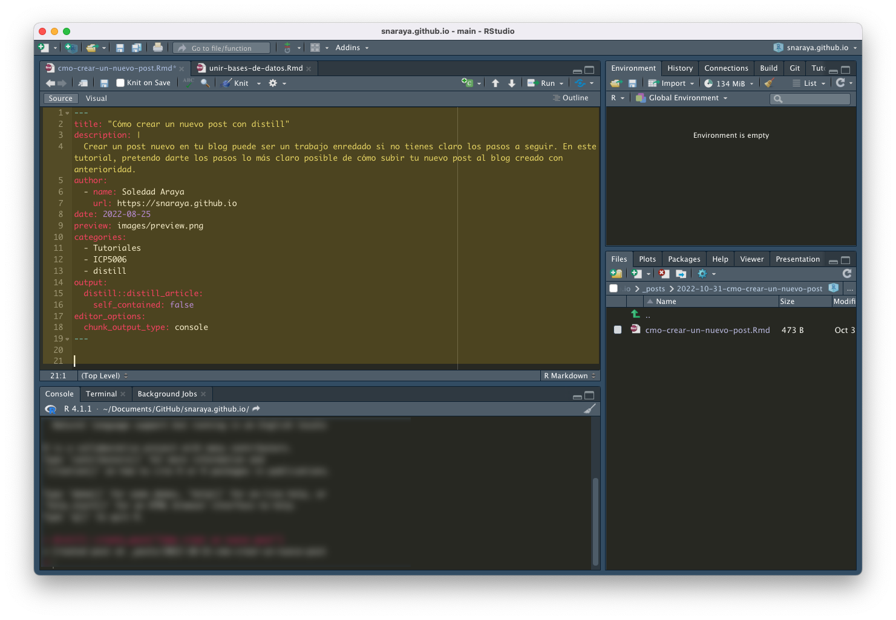
Esta información normalmente la copio y pego de posts creados anteriormente. Al crear el blog, hay una publicación de ejemplo que pueden utilizar en este paso, simplemente deben cambiar la información como título y descripción. En este caso, puse la descripción que ven en el blog.

Pueden ver las distintas opciones en la siguiente [página](https://rstudio.github.io/distill/website.html), Si ponen atención, también verán una forma más eficiente de ignorar archivos para que no suban a GitHub. También existe el [paquete](https://ymlthis.r-lib.org/reference/yml_distill_opts.html) `ymlthis` que les puede ser útil si entienden más el formato R que el anterior. 

Teniendo esto, podemos escribir el contenido:


Esto lo pueden ir modificando a su gusto, en las siguientes páginas pueden ver información que les será de utilidad:

* [R Markdown](https://rmarkdown.rstudio.com/lesson-1.html).
* [Fórmulas en R MArkdown](https://rpruim.github.io/s341/S19/from-class/MathinRmd.html).
* [Editar las opciones de los chunks](https://bookdown.org/yihui/rmarkdown-cookbook/chunk-options.html).
* [Tablas en R Markdown](https://bookdown.org/yihui/rmarkdown-cookbook/tables.html).

Este último es un bookdown muy útil para ver distintos tipos de especificaciones en la creación de un archivo R Markdown como en el que estamos trabajando.

>Los **chunks** son las casillas que abrimos para escribir código.

### Correr el post

Ya terminamos de escribir, pero eso no es suficiente para que sea un página que se refleje en nuestro blog. Una de las cosas que debemos hacer ya con nuestro contenido listo, es "tejer" nuestra publicación. Eso se hace fácilmente apretando el botón `knit`:

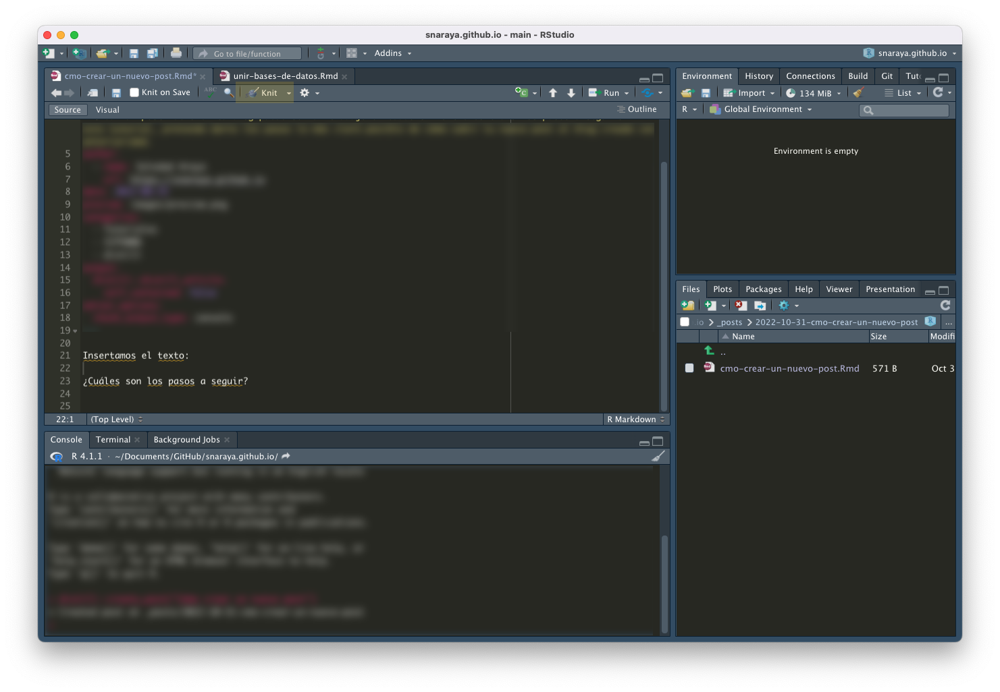
Esta parte, generará dos cosas:

Primero, una visualización de la publicación en su blog:

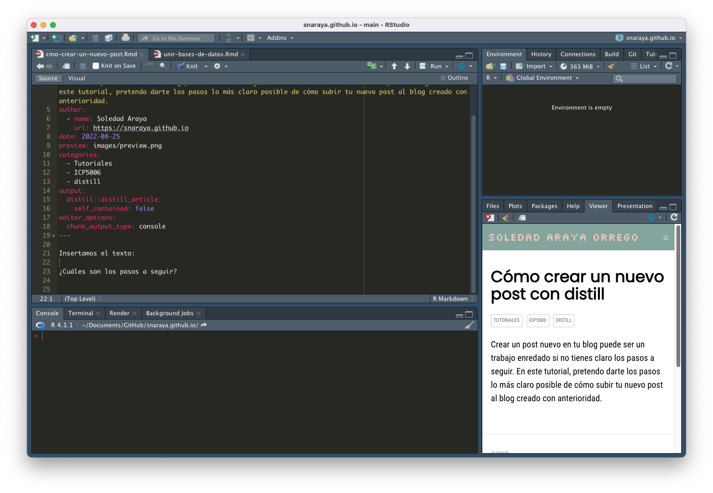

Como también los siguientes archivos:

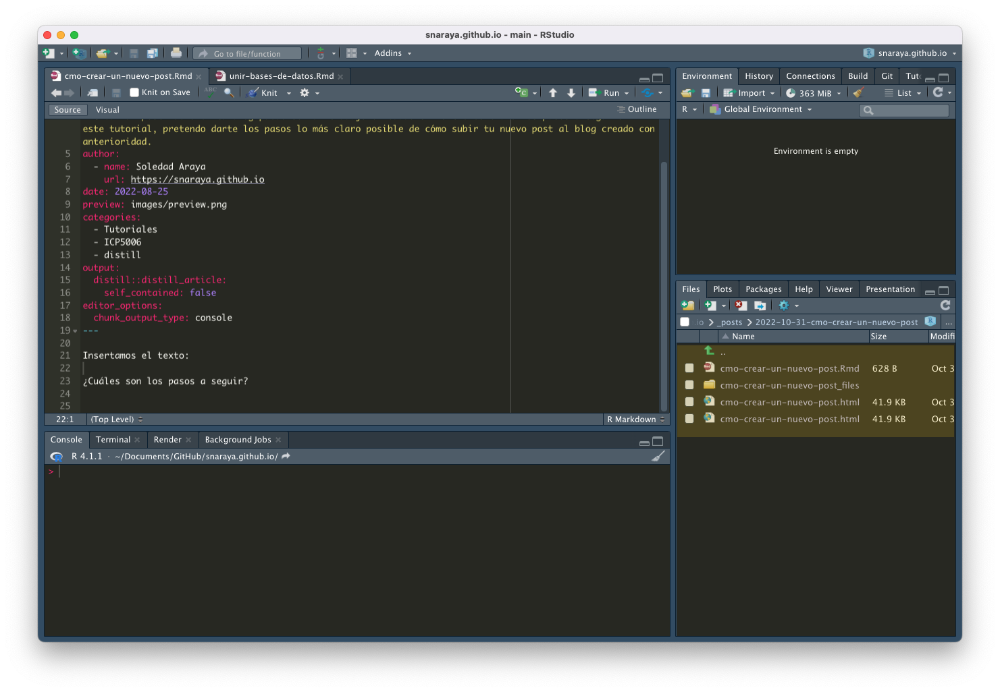

>Excepto la carpeta llamada **images**, que la creé yo para almacenar todas las imágenes que están presentes en esta publicación.

Si todo está ok, deben continuar al siguiente paso.

## Subir el post a GitHub

### Commit

Ahora, debemos abrir GitHub Desktop. En él, verán todos los cambios que hicieron en el proyecto que contiene el blog. Debería ser similar a esto:

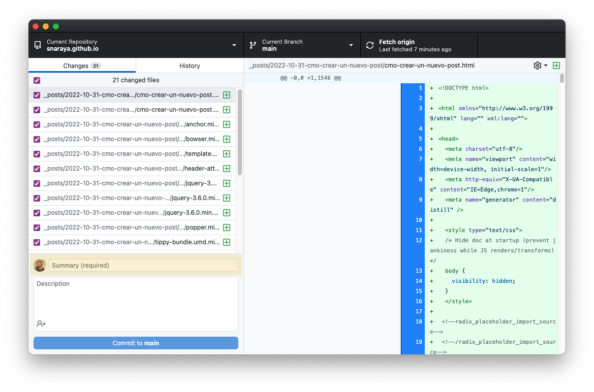

### Push

Como pueden observar, aparecen los cambios, los archivos creados y todo el contenido que generaron. Para subirlo, deben poner una descripción breve en la parte destacada. Al hacer click en `Commit to main`, la página quedará nuevamente en blanco (más que en blanco, como en la pantalla de inicio). Les saldrá un botón `Push origin`, el cual subirá todos los cambios realizados a su carpeta web del proyecto en GitHub.

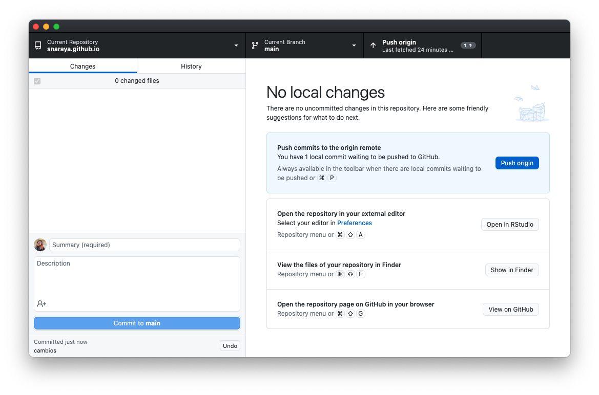
Al hacer click en ese botón, y la página quedará como la que se ve a continuación:

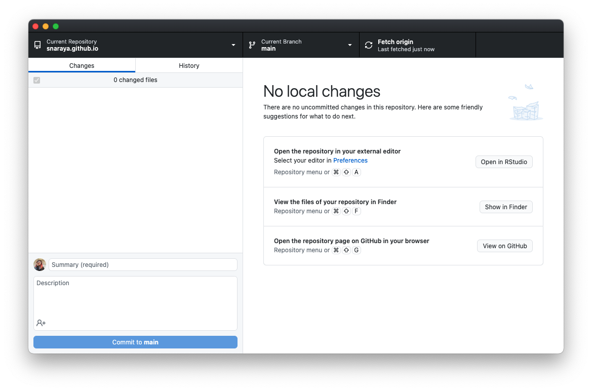
Al finalizar este paso, su página quedará actualizada con los nuevos posts.

## Revisión

La página no se carga automáticamente, deben esperar algunos minutos para revisar la carga en el blog. Dependiendo del tamaño del post, las imágenes, etc. se demorará más en subir. Deben revisar que esté todo ok, pueden hacer estos pasos múltiples veces hasta que queden satisfechos con el resultado.

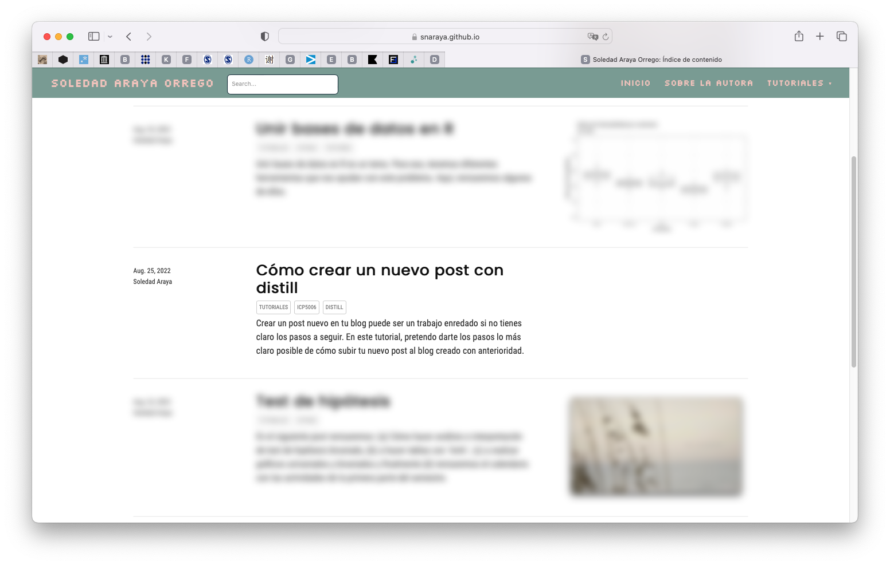

## Carpetas

Al crear un nuevo post, se crea una carpeta como les había mencionado. Esta carpeta se refleja en la carpeta de su proyecto y estará almacenada en la carpeta `_posts`. La mía se ve así después de realizar esta publicación:

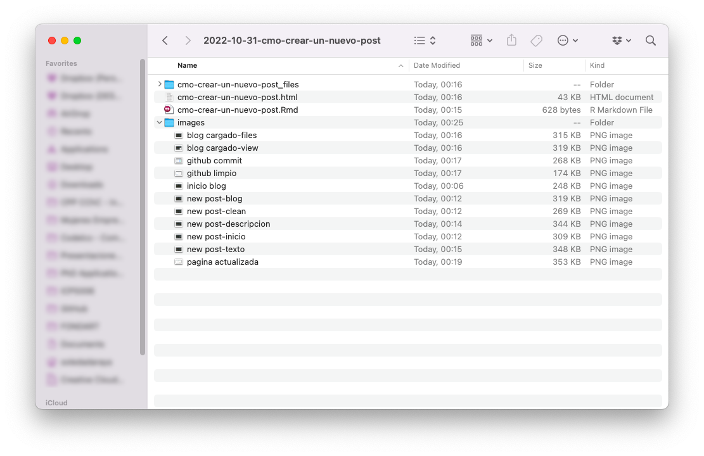

En la carpeta hay una carpeta que contiene la información del blog después de correrlo con `knit`, un archivo `html` y en este caso, todas las imágenes utilizadas en este post.

## .gitignore

Al trabajar con bases de datos, estas también pueden quedar almacenadas en nuestro proyecto. Pero no siempre es posible subirlas, especialmente cuando éstas son **muy pesadas**. Pueden indicarle a Git que no suba esta información en `.gitignore`:

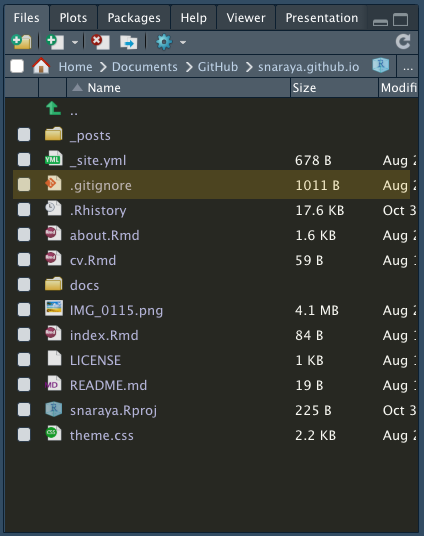

El mio se ve de la siguiente manera:

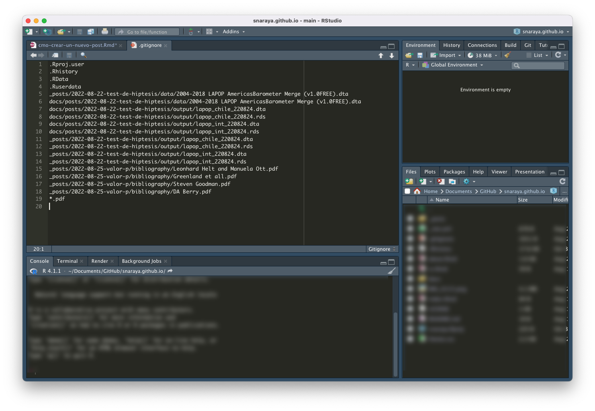

>El mio está horrible.

Yo ignoré algunas bases de datos y pdfs que no era necesario cargar a mi blog. Saqué información de este [foro](https://superuser.com/questions/1431796/difference-between-pdf-and-pdf-in-gitignore) para que `puedan manejar .gitignore con mayor comodidad:

* `.pdf` ignora `.pdf` y `pdf/.pdf`
* `*.pdf` ignora **todos** los archivos con la extensión `.pdf`
* `**/*pdf` realiza la misma función que el de arriba
* `abc.pdf` ignora `abc.pdf`, `pdf/abc.pdf` y `d/pdf/abc.pdf`
* `pdf/abc.pdf` ignora `pdf/abc.pdf`, **pero no** `d/pdf/abc.pdf`
* `# *.pdf` es un comentario dentro del archivo

Para ignorar todos los archivos `*.pdf`, pero no `abd.pdf`, `pdf/abc.pdf` y `d/pdf/abc.pdf`:

```
*.pdf
!abc.pdf
```

