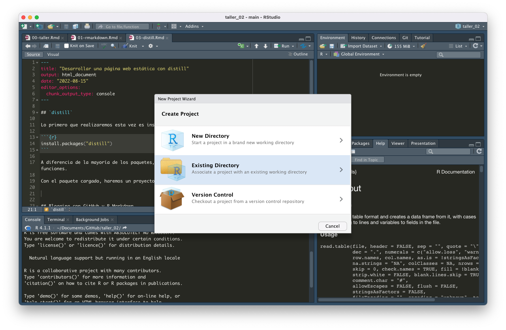
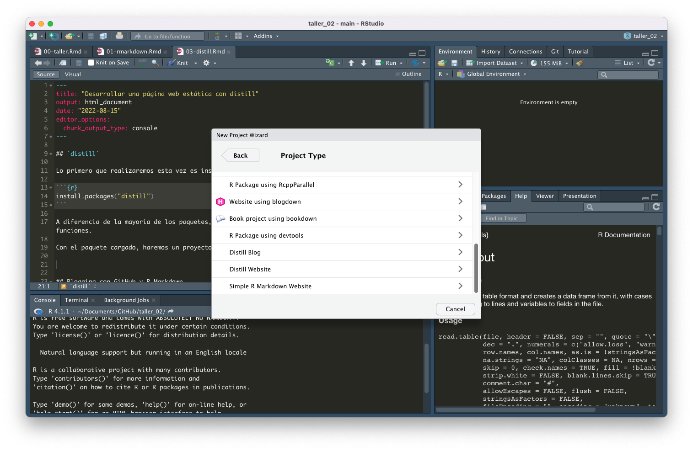
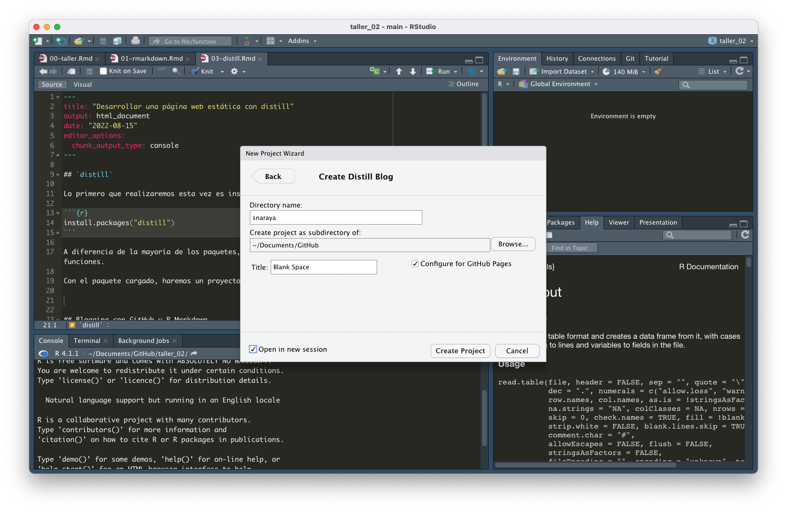
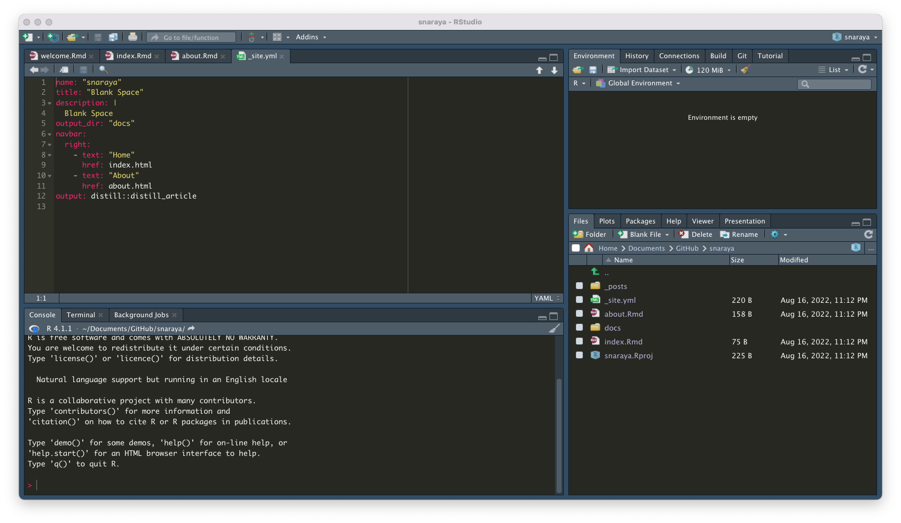
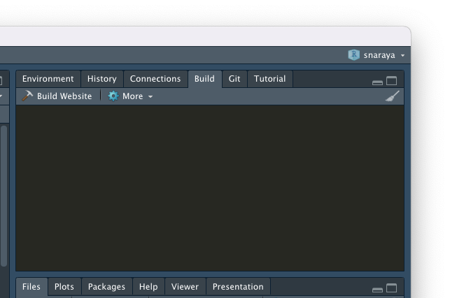
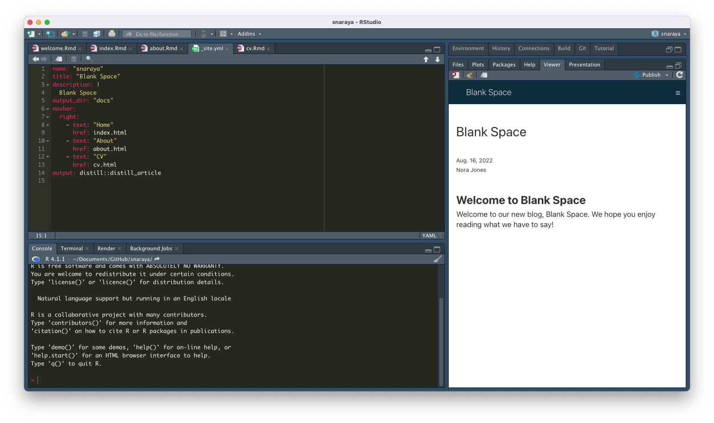
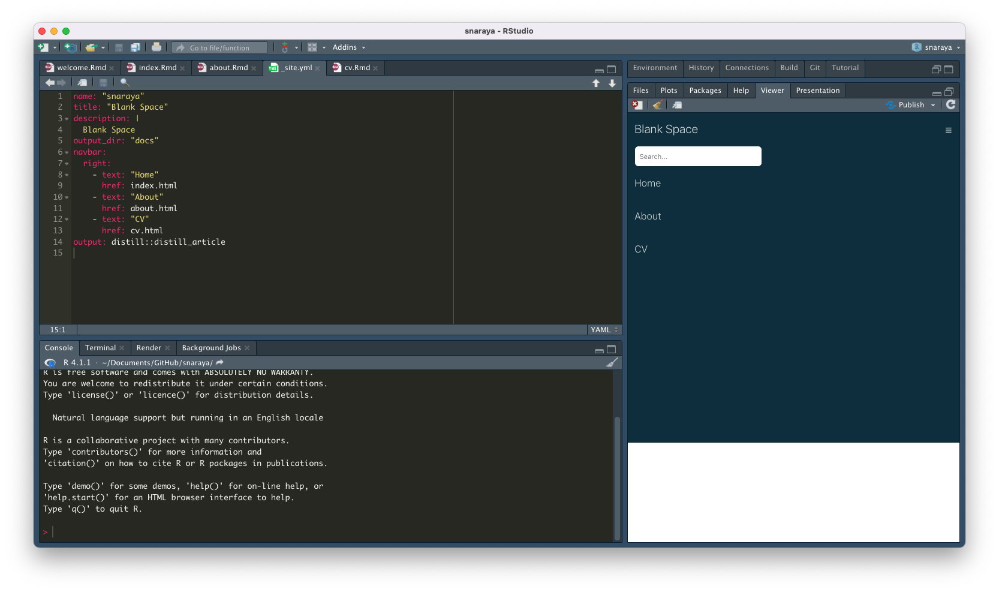

## `distill`

Lo primero que realizaremos esta vez es instalar el paquete que usaremos:

```{r eval=F}
install.packages("distill")
```

A diferencia de la mayoría de los paquetes, no lo cargaremos al ambiente de R, sólo usaremos algunas funciones.

Con el paquete cargado, haremos un proyecto:


Iremos a "New Directory":


Y haremos clic en **Distill Blog**. Nos pedirá poner un nombre a la carpeta, donde estará alojado y el título del blog. 


El blog se creará de manera automática. Esto es lo que verán al momento de crearlo:


**¿Qué significa cada documento?**

```{r message=F, warning=F}
library(knitr)
library(kableExtra)

readxl::read_excel("input/tablas.xlsx", sheet = "tablas_distill") %>% 
  knitr::kable() %>% 
  kable_styling(bootstrap_options = c("striped")) %>% 
  column_spec(1, width_min = "3cm", bold = T) %>% 
  column_spec(2, width_min = "6cm") 
```

## Personalizar el blog:

Hay muchas formas de personalizar el blog. Para empezar, podemos crear un tema:

```{r eval=FALSE}
distill::create_theme("theme")
```

Esto creará un archivo CSS en la carpeta. Pueden modificar a su gusto cómo lucirá su página. Cuando esté listo, sólo deben agregar `theme: theme.css` a su archivo _site.ylm:

```{r eval=F}
name: "snaraya"
title: "Blank Space"
theme: theme.css
navbar:
```

Si buscan personalizar su página, les dejo algunos links de interés:

* [Crear un tema en distill](https://rstudio.github.io/distill/website.html#create-theme).
* [R Markdown Cookbook](https://bookdown.org/yihui/rmarkdown-cookbook/).
* [Paquete pasa usar emojis en R Markdown](https://github.com/hadley/emo).
* Si buscan personalizar la paleta de colores de su página y de los gráficos, les recomiendo [esta página](https://coolors.co/palettes/trending.).

En mi caso, cambié las fuentes y los colores que usa por defecto **Distill**:

* Fuentes:

```{r eval=F}

#En un documento css, la manera de comentar líneas es con */

@import url('https://fonts.googleapis.com/css2?family=Roboto');
@import url('https://fonts.googleapis.com/css2?family=Silkscreen'); 
@import url('https://fonts.googleapis.com/css2?family=Poppins');

  /*-- Specify custom fonts ~~~ must be imported above   --*/
  --heading-font:    'Poppins';
  --mono-font:       'Roboto';
  --body-font:       'Poppins';
  --navbar-font:     'Silkscreen';  /* websites + blogs only */
}
```

* Colores:

```{r eval = F}

.distill-site-header {
  --title-size:       20px;
  --text-color:       #f7ede2;
  --text-size:        15px;
  --hover-color:      #f28482;
  --bkgd-color:       #f5cac3;
}

.distill-site-footer {
  --text-color:       #f7ede2;
  --text-size:        15px;
  --hover-color:      #f28482;
  --bkgd-color:       #f5cac3;
}
```

También, cambié la página **About**:

```{r eval = F}
install.packages("postcards")
```

Usé la función `create_postcard()`:

```{r eval = F}
postcards::create_postcard("about.Rmd")
```

Esto les permitirá tener una buena página que presente su carrera profesional/académica, y que además tenga sus redes sociales y de contacto.

## Publicar nuestro blog:

Usaremos GitHub Pages para lanzar nuestro blog. Hay distintas maneras de poner un blog hecho con R Markdown online, pero nosotros/as usaremos esta versión para ocupar la cuenta que hicimos la semana pasada.

Hay diferentes formas de llegar al mismo destino, probablemente esa es una de las fortalezas de R, pero cuando recién se está aprendiendo esto puede resultar abrumador. En mi caso, yo ya tenía creado un repositorio con el nombre de mi usuario.github.io (https://github.com/snaraya.github.io/). Crearemos, entonces, una repo que nos permita lanzar nuestra página.

Ok, tenemos la repo en nuestra cuenta.

1. Podemos abrir la repo con GitHub Desktop, esto nos creará automáticamente una carpeta local que tendrá un **README.md**. Podemos mover los archivos de nuestro proyecto directamente a esa carpeta. El archivo README.md no es necesario que sea modificado, pero pueden cambiar el nombre y agregar una descripción si lo desean.

2. Iremos a **Build** que se encuentra en el panel superior derecho.



Este paso nos dará una mirada global de la página que estamos creando. Si hay algún problema, lo más probable es que se pueda identificar en este momento. De esa manera, se puede trazar el error. Si no hay errores, es momento de lanzarla.

Si queremos hacerlo desde la consola, podemos poner:

```{r eval=FALSE}
rmarkdown::render_site()
```

Cuando corran la página, ésta se abrirá en el **Viewer**:


Decidí dejar una pestaña para hacer un CV. Ustedes pueden crear tantas secciones como lo crean necesario para el desarrollo de sus proyectos.



3. Archivo **jekill**

GitHub Pages ocupa su propia interfaz al momento de lanzar una página web, por lo que debemos decirle a GitHub que no ocuparemos esa interfaz predeterminada, sino la que creamos con **Distil**. Para eso, crearemos un archivo dentro de nuestra repo:

```{r eval=F}
file.create(".nojekyll")
```

Esto bastará para que nuestro sitio pueda lanzarse de manera exitosa.

4. Lanzamiento

Van a GitHub Desktop y hacen el primer **commit** desde la carpeta local. Esto subirá los archivos en los que han estado trabajando a GitHub, y dentro de unos minutos podrán ver su página lista.

> Pueden hacer su página tan simple o tan compleja como lo quieran. Pueden agregar imágenes a la lista de de publicaciones, cambiar el header; ser creativos. Finalmente, la página representa sus intereses personales y académicos.

***

Fuentes online:
* [Distill for R Markdown](https://rstudio.github.io/distill/).
* [coolors](https://coolors.co/palettes/trending).
